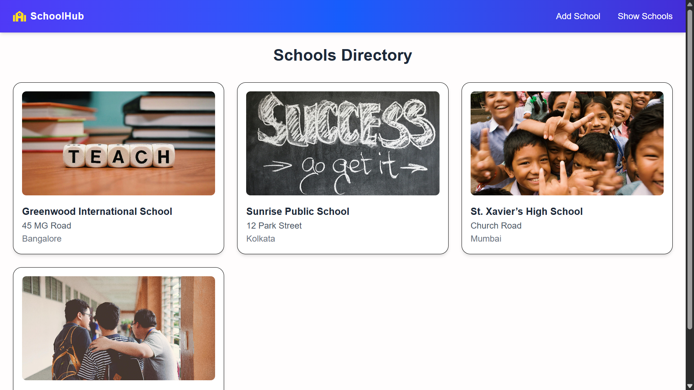
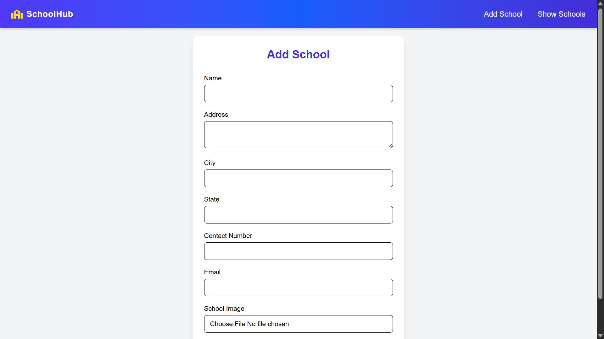

# 🏫 SchoolHub – Manage Schools with Ease  

SchoolHub is a modern **Next.js + MySQL** application that lets you add, view, and manage school records effortlessly.  
It comes with smooth animations, image uploads, and a clean UI powered by **Tailwind CSS** & **Framer Motion**.  

---

## Screen Shorts

<p align="center">
  
  
</p>

## ✨ Features
- 📌 Add new schools with details (name, address, contact, image, etc.)
- 🖼 Upload and store school images
- 🔍 View individual school details on a dedicated page
- ⚡ Smooth UI interactions (loading states, form validation)
- 🗄 MySQL database integration
- 🔐 Secure API routes with Next.js

---

## 🛠 Tech Stack
- **Frontend**: [Next.js](https://nextjs.org/), [React Hook Form](https://react-hook-form.com/), [Framer Motion](https://www.framer.com/motion/), [Tailwind CSS](https://tailwindcss.com/)  
- **Backend**: Next.js API Routes  
- **Database**: MySQL  
- **Other Tools**: Cloudinary / File Upload for images  

## Backend Routes
| Route                            | Method | Description                                     | Request Parameters          | Response Data                 |
|-----------------------------------|--------|-------------------------------------------------|----------------------------|-------------------------------|
| /api/addSchool                   | POST   | Add a new school (with image upload)            | Body: form-data fields: <br>name, address, city, state, contact, email_id, image | JSON: success message, school id |
| /api/getSchools                  | GET    | Get all schools                                 | None                       | JSON: array of schools <br>`[{ id, name, address, city, image }]`    |
| /api/getSchoolById?id=ID         | GET    | Get a single school by its id (query param)     | Query: id                  | JSON: one school object or error |
| /api/getSchoolById/[id]          | GET    | Get a single school by its id (RESTful route)   | Route: /api/getSchoolById/1 | JSON: one school object or error |


---

## 🚀 Getting Started

### 1️⃣ Clone the repository
```bash
git clone https://github.com/Developer200010/school_hub.git
cd /school_hub
npm install
```

## .env
- DB_HOST=localhost
- DB_USER=root
- DB_PASS=yourpassword
- DB_NAME=schoolhub
- CLOUDINARY_CLOUD_NAME=xxxx
- CLOUDINARY_API_KEY=xxxx
- CLOUDINARY_API_SECRET=xxxx

